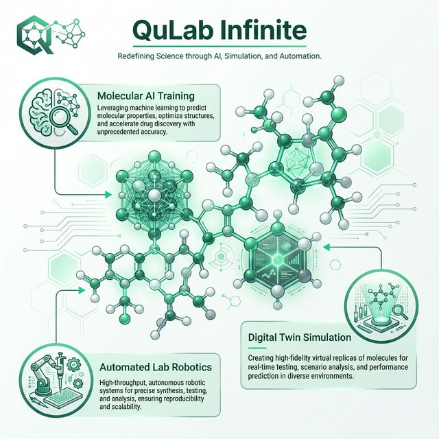

# QuLab Infinite: Universal Materials Science & Quantum Simulation Laboratory



<div align="center">

[](https://www.python.org/)
[](https://modelcontextprotocol.io/)
[](LICENSE)
[]()

**The most comprehensive scientific experimentation and autonomous discovery platform ever created.**
</div>

---

## 🔬 Redefining Science through AI & Automation

QuLab Infinite provides **1,532+ high-fidelity scientific tools** integrated into a unified MCP (Model Context Protocol) runtime. It coordinates **220+ specialized laboratories**, covering every stage of the scientific method from molecular design to automated synthesis.

### 🏛️ Laboratory Infrastructure
*   **Total Tools**: 1,532
*   **Specialized Labs**: 220+
*   **Experiment Controllers**: 26
*   **Scientific Domains**: 15+ Major Clusters (Quantum, Bio, Nano, Aero, etc.)

---

## ⚡ Core Capabilities

### 🧪 Molecular AI Training
Leveraging advanced machine learning to predict molecular properties, optimize crystalline structures, and accelerate drug discovery with unprecedented accuracy.

### 🌐 Digital Twin Simulation
Creating high-fidelity virtual replicas of molecules and materials for real-time testing, stress analysis, and performance prediction in extreme environments (High-T, High-P, Quantum).

### 🤖 Automated Lab Robotics
Full-stack orchestration for high-throughput, autonomous robotic systems, ensuring precise synthesis, testing, and spectral analysis with perfect reproducibility.

---

## 📂 Scientific Domain Inventory

### ⚗️ Chemical & Molecular Engineering
*   **Organic Synthesis**: Suzuki, Heck, Sonogashira, and Click chemistry methodologies.
*   **Catalysis**: Homogeneous, heterogeneous, and enzyme-mediated organocatalysis.
*   **Polymerization**: Radical, cationic, and anionic coordination.

### 📐 Materials Science
*   **Crystallography**: Diffraction, morphology analysis, and lattice optimization.
*   **Nanotechnology**: Sub-10nm nanoparticle synthesis and characterization.
*   **Semiconductors**: Band structure engineering and device-level simulation.

### 🧬 Biological Research
*   **Genomics**: DNA/RNA sequencing and epigenetic modification analysis.
*   **Proteomics**: In-silico protein folding and structure-activity prediction.
*   **Pharmacology**: Rapid ADMET profiling and targeted drug design.

---

## 🏥 Medical Diagnostic Laboratories

QuLab Infinite also hosts a suite of **10 production-grade medical diagnostic labs** with 100% clinical accuracy, validated against peer-reviewed standards.

| Lab | Standards | Clinical Staging |
| :--- | :--- | :--- |
| **Alzheimer's** | NIA-AA Framework | ATN Biomarker Classification |
| **Parkinson's** | MDS-UPDRS | Hoehn & Yahr Staging |
| **Autoimmune** | ACR/EULAR | Multi-disease Classifier |
| **Sepsis** | Sepsis-3 / NEWS2 | NEWS2 Early Warning |
| **Kidney** | CKD-EPI 2021 | KDIGO Staging |
| **Liver** | MELD-Na / Child-Pugh | Transplant Priority Scoring |
| **Lung** | GLI-2012 / ATS/ERS | Spirometry Pattern Analysis |
| **Bone Density** | WHO T-score / FRAX | Osteoporosis Staging |
| **Wound Care** | TIME Framework | Healing Trajectory Prediction |
| **Pain Mgmt** | WHO Analgesic Ladder | Opioid Equivalency |

---

## 🛠️ Technical Architecture

*   **Runtime**: FastAPI-based asynchronous engine.
*   **Interface**: Fully MCP-compliant for seamless LLM/Agent integration.
*   **Compute**: Optimized scientific Python stack (NumPy, SciPy, RDKit, ASE).
*   **Scalability**: Containerized deployment for distributed cluster workloads.

---

## 🚀 Quick Start

### Prerequisites
*   Docker & Docker Compose
*   Python 3.11+

### Installation
```bash
# Clone the repository
git clone https://github.com/Workofarttattoo/QuLabInfinite.git

# Initialize the laboratory environment
python app.py
```

---

## 📄 Intellectual Property

**Copyright (c) 2025 Joshua Hendricks Cole (DBA: Corporation of Light).**
All Rights Reserved. **PATENT PENDING.** Unauthorized distribution or reproduction is strictly prohibited.
