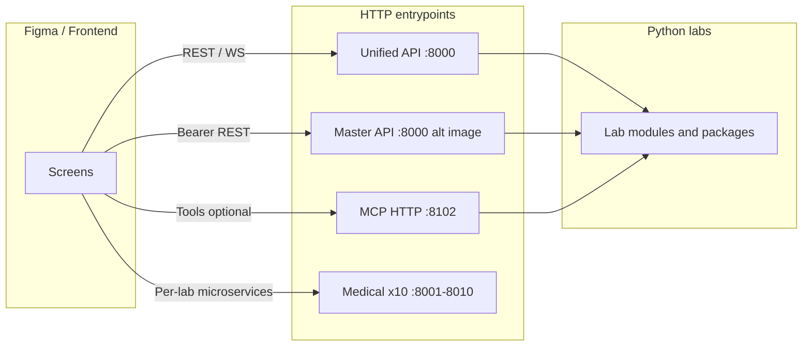

# Figma → QuLab backend wiring guide

This document is for **design and frontend engineering** so screens, prototypes, and production clients call the **correct host**, **auth scheme**, and **routes**. QuLab has **more than one HTTP gateway**; they are not interchangeable.

---

## Product focus: three wedges + “agent + proof”

Ship depth on three pillars; let everything else stay discoverable but secondary.

1. **Materials & structures** — Curated MCP tools for MP records, CIF/POSCAR validation and provenance analysis, batch passes, and dataset health (`/health`, optional JSONL via env). This is the most defensible “infinite parameter space” story for R&D (every structure and query is a new run).
2. **Agent orchestration** — One HTTP contract: **`POST /tools/call`** with stable **`tool`** names and typed **`params`**, plus **`GET /featured`** and **`GET /tools`** for UI pickers. NL maps to tool selection + argument filling; the product sells **tool contracts**, not opaque chat.
3. **Reproducibility** — Golden-run artifacts under `reports/golden_runs/` and the harness in `scripts/run_golden_validations.py`. Annotate hero flows in Figma with “proof ID” / path to JSON when a screen mirrors a validated scenario.

**Differentiation:** competitors lead with workflows and datasets; QuLab leads with **named tools + checksum-style provenance + self-hostable gateways**. The demo only lands if **live `POST /tools/call` matches the annotated tool list below**.

---

## Bootable surfaces (what actually runs as its own process)

| Surface | Command / module | Default port | “Open-ended?” |
|--------|-------------------|--------------|----------------|
| **MCP HTTP** | `python unified_mcp_server.py` | **8102** (`QU_LAB_MCP_PORT`) | **Yes** — curated tools + **dynamic** tools from lab cartography (`GET /tools`, `GET /map`) |
| **Unified API** | `uvicorn api.unified_api:app` | **8000** | **Yes** — POST bodies are parameterized (`/materials/analyze`, `/chemistry/synthesize`, …) |
| **Master API** | `uvicorn master_qulab_api:app` | **8000** (alternate image) | **Partial** — `POST /labs/{lab_name}/optimize` with a **`parameters`** object; lab availability depends on optional imports |
| **Medical bundle** | `scripts/start_medical_labs.sh` | **8001–8010** | **Per OpenAPI** — each module exposes its own `/docs` on that port |

### Master API: registered lab keys (`POST /labs/{lab_name}/optimize`)

These keys exist in **`LAB_REGISTRY`** in `master_qulab_api.py`:  
`quantum`, `materials`, `chemistry`, `frequency`, `oncology`, `protein_folding`, `cardiovascular`, `tumor_evolution`, `genetic_variants`, `cancer_metabolic`, `drug_interaction`, `immune_response`, `neurotransmitter`, `microbiome`, `metabolic_syndrome`, `stem_cell`, `medical_safety`.

Wire Figma “Master” variants to **`lab_name`** + example **`parameters`** from `/openapi.json` on your deployed host.

### Medical microservices (script order)

| Port | Module |
|------|--------|
| 8001 | `alzheimers_early_detection` |
| 8002 | `parkinsons_progression_predictor` |
| 8003 | `autoimmune_disease_classifier` |
| 8004 | `sepsis_early_warning` |
| 8005 | `wound_healing_optimizer` |
| 8006 | `bone_density_predictor` |
| 8007 | `kidney_function_calculator` |
| 8008 | `liver_disease_staging` |
| 8009 | `lung_function_analyzer` |
| 8010 | `pain_management_optimizer` |

### MCP: curated tools (stable names for Figma Dev Mode)

**Invoke:** `POST {MCP_BASE}/tools/call`  
**Body:** `{ "tool": "<name below>", "params": { ... } }`  
Params mirror the underlying Python functions (citations optional where supported).

| `tool` | Typical `params` | Suggested Figma screen |
|--------|------------------|-------------------------|
| `materials.get_mp_material` | `mp_id` (string) | Materials bundle → database / MP strip |
| `materials.analyze_structure` | `file_path`, optional `citations` | Materials → structure + provenance panel |
| `materials.batch_analyze_structures` | `file_paths` (list) | Materials → batch table |
| `materials.validate_structure` | `file_path` | Materials → upload / validation gate |
| `materials.database_info` | `{}` | Materials → dataset health / empty-state |
| `chemistry.analyze_molecule` | `smiles`, optional `citations` | Chemistry / Molecular suite |
| `chemistry.batch_analyze_molecules` | `smiles_list` (list of strings) | Chemistry → batch |
| `chemistry.validate_smiles` | `smiles` | Chemistry → input validation |
| `chemistry.create_water_box` | `n_molecules`, optional `box_size` | Chemistry → MD prep |
| `physics.get_element_properties` | `element_symbol` | R&D sidebar |
| `physics.create_benchmark_simulation` | `problem` (string) | R&D / benchmark |
| `ai.calc` | `expr` (string, numeric expression) | Command center quick calc |
| `ech0.analyze_material` | `material_name` | R&D + Echo / invention |
| `ech0.design_selector` | `application`, optional `budget_per_kg` | R&D candidate picker |
| `ech0.filter_inventions` | `inventions` (list of dicts), optional `top_n` | R&D ranking |
| `ech0.optimize_design` | In-process Python API takes `constraints` as **functions** — not JSON-serializable via `POST /tools/call` today; use dynamic lab tools or wrap for HTTP. | R&D optimize (future HTTP wrapper) |
| `ech0.quick_invention` | `name`, `description`, optional `application`, `budget` | R&D rapid POC |
| `pocket.add_lab_note` | `note`, optional `tags`, `context`, `priority` | Flash Joule / lab-floor log |
| `pocket.list_lab_notes` | optional `limit`, `context` | Lab-floor history |
| `pocket.search_lab_notes` | `query`, optional `limit` | Lab-floor search |
| `pocket.flash_joule_advisor` | optional `mode` (default `pre_fire_gate`) | FJH safety / guidance tile |
| `pocket.log_fjh_run` | `run_id`, `ingredients`, `electrical_load_a`, `temperature_reached_c`, `pulse_time_ms`, optional `voltage_v`, `pulse_count`, `date`, `time_local`, `protocol_name`, `notes` | FJH runbook capture |
| `pocket.list_fjh_runs` | optional `limit` | FJH runs list |
| `pocket.search_fjh_runs` | `query`, optional `limit` | FJH search |
| `pocket.add_cookbook_entry` | `title`, `content`, optional `tags`, `source` | Grounding snippets |
| `pocket.list_cookbook_entries` | optional `limit` | Cookbook list |
| `pocket.ask_fjh_assistant` | `question`, optional `limit_context` | NL → grounded FJH Q&A |

**Dynamic tools:** many additional names appear at runtime (`source: dynamic` in `GET /tools`). Treat them as **discovered capabilities** — same `POST /tools/call` shape; parameters come from `parameter_schema` in the listing.

### MCP: preset experiment *files* (lower priority for “infinite lab” UI)

`GET /tools` includes an **`experiments`** array (`oncology.demo_experiment`, harness paths, etc.). These are **repository scripts / smoke harnesses**, not the main product loop. Prefer annotating Figma with **curated `tool` names** above or **dynamic** tools from `/tools`.

---

## Tactical Glass OS (Stitch reference)

For visual parity with the HTML references (global dashboard, medical directory, materials / molecular / stem tiles):

- **Typography:** Space Grotesk (headings), JetBrains Mono (labels, data, logs).
- **Background:** near-black `#131313`; **accent cyan** `#00dbe9` / `#00f0ff`; **secondary green** `#13ff43` / `#00e639`.
- **Panels:** translucent dark fill, 0.5px light border, light backdrop blur; optional scanline overlay at very low opacity.

Map NL-first controls to **`POST /tools/call`** (primary) or Unified **`POST`** routes where the screen targets browser demos without MCP.

---

## Product screens in Figma (Lab Console v1)

A first-pass **desktop flow** (boot → command center → grouped lab bundles → **Materials + R&D synergy unlock**) lives here:

**[QuLab Infinite — Lab Console UX v1](https://www.figma.com/design/N9joP1YMYdWU1kWWIZbTBm)**

In the same file, frame **`00 BACKEND_TOOL_CONTRACTS`** lists **`POST /tools/call`** example bodies (materials, chemistry, Echo) and reminds medical tiles to use **per-port `/docs`**. Shared plugin data: namespace `qulab.io`, keys `mcp_contract_version`, `docs_path`.

Use **Stitch / Prototype** to link: `01 Boot` → `02 Command center` → `03 Materials` / `04 Chemistry` / `05 R&D orchestration` → `06 Unlock synergy` when both bundles are active. Swap in your existing Stitch assets by pasting into these frames or replacing placeholders.

---

| Gateway | Typical port (local) | Auth | Best for |
|--------|----------------------|------|-----------|
| **Unified API** (`api.unified_api:app`) | **8000** | `X-Api-Key` **or** query `api_key` | REST + WebSocket lab flows; granular routes like `/materials/analyze` |
| **Master API** (`master_qulab_api:app`, Docker `Dockerfile.master`) | **8000** | `Authorization: Bearer <key>` | Single gateway: `GET /labs`, `POST /labs/{lab_name}/optimize` |
| **MCP HTTP** (`unified_mcp_server.py`) | **8102** (`QU_LAB_MCP_PORT`) | Optional `QULAB_MCP_API_KEY` (Bearer or `X-MCP-Api-Key`) | **Primary agent/product tool gateway:** `GET /featured` (Materials & R&D default), `GET /tools`, `POST /tools/call` |
| **10 medical microservices** | **8001–8010** | Per-app (check each module) | One FastAPI app per diagnostic lab when using `scripts/start_medical_labs.sh` or `docker-compose.medical.yml` |

**Rule for Figma annotations:** Put the **base URL** on the frame (e.g. `{{API_BASE}}` = `http://localhost:8000`) and the **full path + method** on the component that triggers the call.

**Default dev commands (from project docs):**

```bash
# Unified API (OpenAPI at /docs)
python -m uvicorn api.unified_api:app --reload --host 0.0.0.0 --port 8000

# MCP server
python unified_mcp_server.py   # QU_LAB_MCP_PORT (default 8102)

# Desktop Lab Console (requires: pip install -e ".[lab-console]")
python -m lab_console
# or: qulab-lab-console
```

Docker Compose “master” stack publishes **8000** to **`master_qulab_api:app`**, not `api.unified_api` — confirm with DevOps which image is deployed.

### 1b. MCP: Materials & R&D first (`/featured`)

For **materials, chemistry, physics, invention (Ech0), and lab-floor (Flash Joule)** flows, prefer the MCP base URL (e.g. `{{MCP_BASE}}` = `http://localhost:8102`).

| Method | Path | Purpose |
|--------|------|---------|
| GET | `/featured` | Defaults to `department=materials_rd`: tool list + `quick_start_tools` for hero screens |
| GET | `/featured?department=life_sciences` | Dynamic biology/medicine-typed labs only |
| GET | `/tools?department=materials_rd` | Full filtered catalog; `stats.tools_by_department` for admin UI |
| GET | `/health` | `materials_mp_ready`, dataset path, tool counts |

Tool list entries include **`department`**: `materials_rd` | `life_sciences` | `general`.

**Invoke any tool:** `POST /tools/call` with JSON `{ "tool": "<name>", "params": { ... } }` (params match the Python function signature).

Production checklist: [MATERIALS_RD_PRODUCTION.md](MATERIALS_RD_PRODUCTION.md).

---

## 2. Unified API (`api/unified_api.py`) — REST contract essentials

### 2.1 Authentication

- **Headers:** `X-Api-Key: <your-key>` (preferred for browsers that block custom bodies on GET).
- **Alternative:** `?api_key=<your-key>` on any route that accepts query params (supported by shared `verify_api_key`).

Keys are loaded from **`QU_LAB_MASTER_KEYS`** (comma-separated). Server fails fast if unset or placeholder keys — see `core/security.py`.

### 2.2 CORS

`allow_origins=["*"]` is enabled for dev; production may lock this down — frontend should still use env-based `API_BASE`.

### 2.3 Discovery & health

| Method | Path | Auth | Notes |
|--------|------|------|--------|
| GET | `/` | No | Service metadata, lab names, pointer to `/docs` |
| GET | `/health` | No | Liveness |
| GET | `/labs` | Yes | Catalog of lab descriptions and *documented* sub-routes |

### 2.4 Domain routes (all **POST** unless noted, **auth required**)

Wire each primary screen to one of these; bodies match the Pydantic models in `api/unified_api.py`.

| Path | Request body (summary) | Suggested UI |
|------|------------------------|--------------|
| `POST /materials/analyze` | `material_name`, `temperature`, `pressure`, `properties[]` | Material explorer / property panel |
| `GET /materials/search` | Query: `query`, `limit` | Search results list |
| `POST /quantum/simulate` | `system_type`, `num_qubits`, `circuit_depth`, `algorithm` | Quantum run config + results |
| `POST /chemistry/synthesize` | `reaction_type`, `reactants[]`, `target_product?`, `conditions` | Reaction planner |
| `POST /oncology/simulate` | `cancer_type`, `stage`, `mutations[]`, `treatment_protocol` | Oncology scenario (label as simulation) |
| `POST /drug/screen` | `target_protein`, `screening_mode`, `num_candidates` | Screening job |
| `POST /genomics/analyze` | `genome_sequence`, `analysis_type`, `reference_genome` | Sequence upload / analysis |
| `POST /immune/simulate` | `pathogen_type`, `immune_state`, `intervention?` | Immune dashboard |
| `POST /metabolic/analyze` | `condition`, `biomarkers` map, `intervention` | Metabolic planner |
| `GET /analytics` | — | **Enterprise tier only** (`user["tier"] == "enterprise"`) |
| `POST /batch` | `lab`, `requests[]` | **Not** `free` tier |

**Exact JSON shapes:** use **OpenAPI** at `{API_BASE}/docs` or `/redoc` while the server is running — that is the source of truth for Figma Dev Mode property lists.

### 2.5 WebSocket — real-time / progress UI

- **URL:** `ws://{host}:{port}/ws/{lab_name}` (TLS → `wss://` in production).
- **Path param:** `lab_name` (e.g. `materials`, `quantum`) — drives stubbed branch logic in the handler.
- **Client → server:** text frame, JSON object (structure is generic today).
- **Server → client:** JSON messages with types such as `materials_result`, `quantum_result`, `progress`, `complete`.

**Auth:** Endpoint uses the same `verify_api_key` dependency; WebSocket clients must send **`X-Api-Key`** (or supported headers) on the **handshake** per FastAPI behavior.

Map Figma “streaming / progress” components to this socket, not to repeated POST polling, unless you add polling in the app layer.

### 2.6 Implementation note for integrators

`api/unified_api.py` resolves the repo root from `Path(__file__)` so imports work on any machine. Client code should only depend on **`API_BASE`**, not local paths.

---

## 3. Master API (`master_qulab_api.py`) — second style of “one gateway”

Use this when the deployed stack is **`uvicorn master_qulab_api:app`** (e.g. Docker master image).

| Method | Path | Auth |
|--------|------|------|
| GET | `/` | Bearer |
| GET | `/labs` | Bearer |
| GET | `/labs/{lab_name}` | Bearer |
| POST | `/labs/{lab_name}/optimize` | Bearer |
| GET | `/health` | Bearer |

- **Header:** `Authorization: Bearer <key>`.
- Keys: **`QU_LAB_MASTER_KEYS`** (same env family; see `load_api_keys_from_env`).
- **Body for optimize:** `OptimizationRequest` — `lab_name` (also in path), `parameters` object, optional `options`.

Sub-labs (quantum, materials, chemistry, frequency, oncology, …) are listed in **`LAB_REGISTRY`** in code; nested FastAPI apps may be mounted for some domains — confirm in `/openapi.json` for your build.

**Figma tip:** If the product uses **Master API**, annotate screens with “Bearer” not “X-Api-Key”.

---

## 4. MCP HTTP server (`unified_mcp_server.py`)

For **AI/agent** features or internal tools that call **`tool` names** rather than REST resources:

| Method | Path | Purpose |
|--------|------|---------|
| GET | `/tools` | List curated + dynamic tools, cartography |
| POST | `/tools/call` | Body: `{ "tool": "materials.analyze_structure", "params": { ... } }` |
| GET | `/map` | Broader map + materials dataset summary |

Default **`http://0.0.0.0:8102`**. Product UI that mirrors “tool picker” or admin consoles can target this; most customer-facing science screens will still use **Unified** or **Master** API.

---

## 5. Ten standalone medical labs (optional deployment)

When **`scripts/start_medical_labs.sh`** runs with `LAB_PORT_PREFIX=800`:

| Port | Uvicorn module |
|------|----------------|
| 8001 | `alzheimers_early_detection:app` |
| 8002 | `parkinsons_progression_predictor:app` |
| 8003 | `autoimmune_disease_classifier:app` |
| 8004 | `sepsis_early_warning:app` |
| 8005 | `wound_healing_optimizer:app` |
| 8006 | `bone_density_predictor:app` |
| 8007 | `kidney_function_calculator:app` |
| 8008 | `liver_disease_staging:app` |
| 8009 | `lung_function_analyzer:app` |
| 8010 | `pain_management_optimizer:app` |

Each is a **separate** OpenAPI doc (typically `/docs` on that port). Figma variants for “medical suite” should tag **`MEDICAL_BASE`** or per-port bases — not the main 8000 unified app unless you explicitly proxy them.

---

## 6. Figma file hygiene (recommended)

1. **Variables:** `API_BASE` (Unified/Master), `MCP_BASE`, `WS_BASE` (often `API_BASE` with `ws` scheme).
2. **Component property:** `endpoint` (string), `method`, `requiresAuth` (boolean).
3. **Dev Mode:** Link to **`{API_BASE}/docs`** for schema; paste example JSON from OpenAPI.
4. **States:** `401` / `403` / `429` / `503` — Unified API uses **401** for missing/invalid key; batch/analytics use **403** by tier; oncology may return **503** if backend optional import failed.

---

## 7. One-page architecture (logical)



---

## 8. Who to ask when unsure

- **“Which server is production?”** → Team running Docker / k8s (check `Dockerfile.master` vs `api.unified_api`).
- **“Exact field list for a form?”** → **`/docs`** on the running server for that gateway.
- **“Do we have one lab per port?”** → **No**, except the **10 medical** apps above; everything else is usually **routed inside one app** or via **MCP tool names**.

---

*Last aligned to repository layout: `api/unified_api.py`, `master_qulab_api.py`, `unified_mcp_server.py`, `scripts/start_medical_labs.sh`, `core/security.py`.*
